# Praktikum3
# NAMA  :   VIENA DWI PUTRI MAULINA
# NIM   :   312110469
# KELAS :   TI.21.C1
# TUGAS BAHASA PEMOGRAMAN

# Labspy02
<h1> Latihan 1 <h1>
<h1>  Program menentukan nilai akhir <h1>

 program ini bertujuan untuk menentukan nilai akhir apakah lulus atau tidak. Dengan memasukan nilai UTS, UAS, dan nilai tugas. jika hasil dari

(tugas*2)+(uts*4)+(uas*4) adalah

 > 80 maka bernilai A 

 > 70 maka bernilai B 

 > 50 maka bernilai C 

 > 40 maka bernilai D 

 dan jika < 40 bernilai E 

dan jika hasil nilai tersebut diatas 60 maka LULUS, jika dibawah 60 maka TIDAK LULUS 
 

 misal buat script seperti berikut 

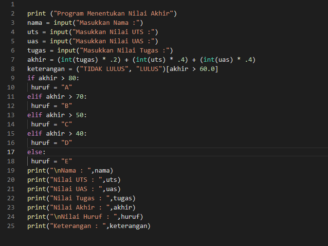
<
 kemudian run, masukan nama,  nilai tugas, uts dan uas.

 misal nilai uts 80, uas 75, nilai tugas 85 maka hasil run seperti berikut 

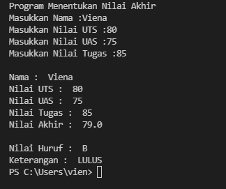

hasil nilainya adalah 79.0 maka nilai hurufnya B dan keterangannya adalah lulus karna nilai diatas 60 
flowchartnya seperti berikut 

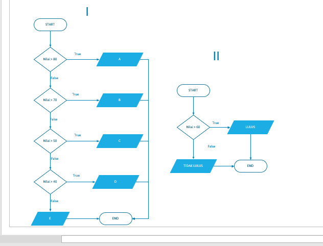

<h1> Latihan 2
<h1> Program menampilkan status gaji karyawan <h1>

Jika gaji diatas 3juta maka gaji sudah UMR

 jika gaji sudah diatas umr maka : 

 jika sudah berkeluarga, maka wajib ikutan asuransi dan menabung untuk pensiun, tetapi jika belum berkeluarga maka tidak perlu ikutan asuransi

 jika sudah punya rumah maka wajib bayar pajak rumah, tetapi jika belum punya rumah maka tidak wajib bayar pajak rumah 

 jika gaji dibawah 3juta maka gaji belum umr

 berikut program nya 

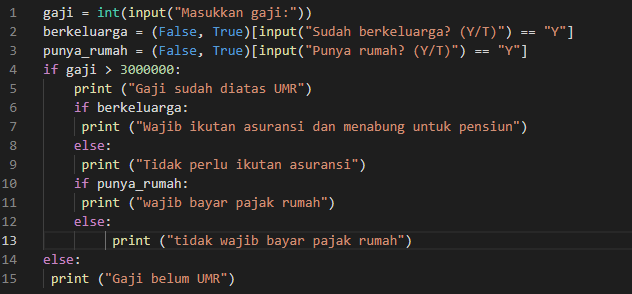

kemudian run, masukan gaji, jawab y/t pada pertanyaan sudah berkeluarga atau belum, dan pertanyaan sudah punya rumah atau belum 

misal gaji 5000000, belum berkeluarga dan sudah punya rumah. maka hasil run seperti berikut 

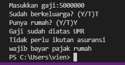

 hasilnya adalah gaji sudah diatas umr, tidak perlu ikutan asuransi dan wajib bayar pajak rumah 

 flowchartnya seperti berikut 

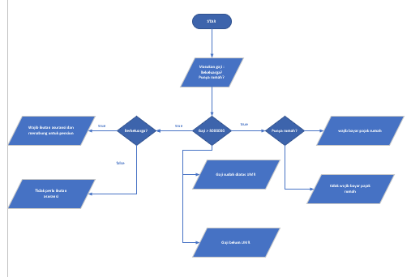

<h1> Latihan 3 <h1>
<h1> Program penggunaan kondisi OR <h1>

 Program membandingkan 3 input  bilangan, apabila penjumlahan 2 bilangan hasilnya sama dengan bilangan lainnya, maka cetak pernyataan "benar" 

berikut scriptnya 

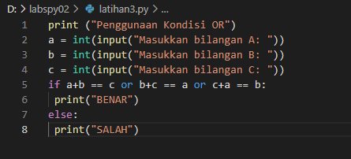

 kemudian run, masukan nilai A,B,C (8,5,3) . maka hasil run seperti berikut

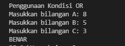

 hasil run adalah benar karna bilangan B (5) ditambah bilangan c (3) adalah bilangan A (8) 

 flowchartnya seperti berikut 

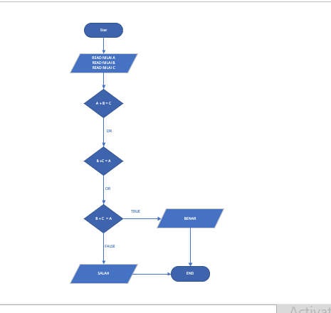

<h1> Latihan 4 <h1>
<h1> Program mencari nilai terbesar dari 3 bilangan yang diinputkan <h1>

 program sederhana dengan input 3 buah bilangan, dari ketiga bilangan tersebut tampilkan bilangan terbesarnya dengan menggunakan statemen if 

 berikut scriptnya 

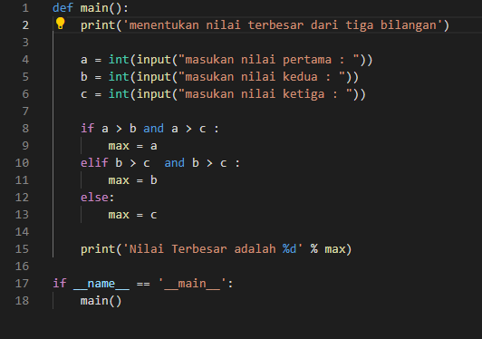

 kemudian run, masukan nilai a,b,c misal 9,4,7 . kemudian program mencari nilai terbesarnya. hasil run seperti berikut.

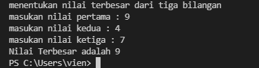

 nilai terbesar adalah 9 

 flowchartnya seperti berikut 

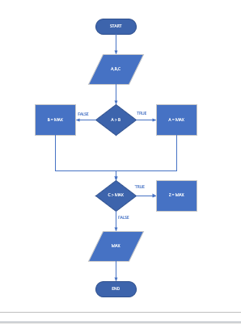

