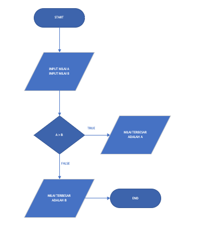

# Praktikum3
# NAMA  :   VIENA DWI PUTRI MAULINA
# NIM   :   312110469
# KELAS :   TI.21.C1
# TUGAS BAHASA PEMOGRAMAN

# Labspy02
<h1> Latihan 1 <h1>
<h1>  Program menentukan nilai akhir <h1>

 program ini bertujuan untuk menentukan nilai akhir apakah lulus atau tidak. Dengan memasukan nilai UTS, UAS, dan nilai tugas. jika hasil dari

(tugas*2)+(uts*4)+(uas*4) adalah

 > 80 maka bernilai A 

 > 70 maka bernilai B 

 > 50 maka bernilai C 

 > 40 maka bernilai D 

 dan jika < 40 bernilai E 

dan jika hasil nilai tersebut diatas 60 maka LULUS, jika dibawah 60 maka TIDAK LULUS 
 

 misal buat script seperti berikut 

<
 kemudian run, masukan nama,  nilai tugas, uts dan uas.

 misal nilai uts 80, uas 75, nilai tugas 85 maka hasil run seperti berikut 

hasil nilainya adalah 79.0 maka nilai hurufnya B dan keterangannya adalah lulus karna nilai diatas 60 
flowchartnya seperti berikut 

<h1> Latihan 2
<h1> Program menampilkan status gaji karyawan <h1>

Jika gaji diatas 3juta maka gaji sudah UMR

 jika gaji sudah diatas umr maka : 

 jika sudah berkeluarga, maka wajib ikutan asuransi dan menabung untuk pensiun, tetapi jika belum berkeluarga maka tidak perlu ikutan asuransi

 jika sudah punya rumah maka wajib bayar pajak rumah, tetapi jika belum punya rumah maka tidak wajib bayar pajak rumah 

 jika gaji dibawah 3juta maka gaji belum umr

 berikut program nya 

kemudian run, masukan gaji, jawab y/t pada pertanyaan sudah berkeluarga atau belum, dan pertanyaan sudah punya rumah atau belum 

misal gaji 5000000, belum berkeluarga dan sudah punya rumah. maka hasil run seperti berikut 

 hasilnya adalah gaji sudah diatas umr, tidak perlu ikutan asuransi dan wajib bayar pajak rumah 

 flowchartnya seperti berikut 

<h1> Latihan 3 <h1>
<h1> Program penggunaan kondisi OR <h1>

 Program membandingkan 3 input  bilangan, apabila penjumlahan 2 bilangan hasilnya sama dengan bilangan lainnya, maka cetak pernyataan "benar" 

berikut scriptnya 

 kemudian run, masukan nilai A,B,C (8,5,3) . maka hasil run seperti berikut

 hasil run adalah benar karna bilangan B (5) ditambah bilangan c (3) adalah bilangan A (8) 

 flowchartnya seperti berikut 

<h1> Latihan 4 <h1>
<h1> Program mencari nilai terbesar dari 3 bilangan yang diinputkan <h1>

 program sederhana dengan input 3 buah bilangan, dari ketiga bilangan tersebut tampilkan bilangan terbesarnya dengan menggunakan statemen if 

 berikut scriptnya 

 kemudian run, masukan nilai a,b,c misal 9,4,7 . kemudian program mencari nilai terbesarnya. hasil run seperti berikut.

 nilai terbesar adalah 9 

 flowchartnya seperti berikut 

# Labspy03

<h1> Latihan 1 <h1>
<h1> Menampilkan n bilangan acak yang lebih kecil dari 0.5 <h1>

 buat script seperti berikut 

 kemudian run, masukan nilai N, misal 8 maka hasil run seperti berikut 

 flowchartnya seperti berikut 

<h1> Latihan 2 <h1>
<h1> Program menampilkan terbesar dari n <h1>

 program ini menampilkan bilangan terbesar dari n buah data yang diinputkan. masukan angka 0 untuk berhenti 

 buat program seperti berikut 

kemudian run, masukan bilangan. jika memasukan bilangan 0, maka program berhenti mengulang dan menghasilkan output seperti berikut

 flowchartnya seperti berikut 

<h1> program 1 <h1>
<h1> program laba investasi <h1>

 Seorang pengusaha menginvestasikan uangnya untuk memulai usahanya dengan modal 100 juta. pada bulan pertama dan kedua belum mendapatkan laba. pada bulan ketiga baru mulai mendapatlan laba sebesar 1% dan pada bulan kelima pendapatan meningkat 5%, selanjutnya pada bulan ke-8 mengalammi penurunan keunrungan sebesar 2% sehingga laba menjadi 3%. hitung total keuntungan selama 8 bulan berjalan usahanya.

 buat script seperti berikut 

 kemudian run, masukan uang muka 

 maka hasilnya seperti berikut 

 flowchartnya seperti berikut 

# Praktikum 3
<h1> Latihan 1 <h1>
<h1> Program menentukan nilai terbesar dari dua bilangan yang diinputkan <h1>

 Program sederhana dengan input 2 buah bilangan, kemudian tentukan bilangan terbesar dari kedua bilangan tersebut menggunakan statement if 

 berikut script nya 

 kemudian run, masukan 2 bilangan, maka program akan menentukan nilai terbesar dari 2 bilangan tersebut. misal nilai pertama 73, nilai kedua 91. kemudian enter dan hasilnya seperti ini. 

 hasilnya adalah 91 

 flowchartnya seperti berikut 

<h1> Latihan 2 <h1>
<h1> Program mengurutkan angka dari yang terkecil sampai terbesar <h1>

 Program ini untuk mengurutkan data berdasarkan input sejumlah data , kemudian tampilkan hasilnya secara berurutan mulai dari data terkecil 

 berikut scriptnya 

pada for i in range (5) itu adalah pengulangan sampai berapakali menginputkan data 

 kemudian run, masukan 5 angka 

 misal 83,51,93,62,41 

 hasil run seperti berikut 

 flowchartnya seperti berikut 

<h1> Latihan 3 <h1>
<h1> Program perulangan bertingkat (nested) for <h1>

 berikut scriptnya 

 maka hasil run tersebut seperti berikut 

<h1> Latihan 4<h1>
<h1> Program menampilkan n  bilangan acak yang lebih kecil dari 0.5 <h1>

 berikut scriptnya 

 kemudian run, masukan jumlah n 

 maka hasilnya seperti berikut 

 flowchartnya seperti berikut 

 SEMOGA BERMANFAAT 

 TERIMAKASIH 

